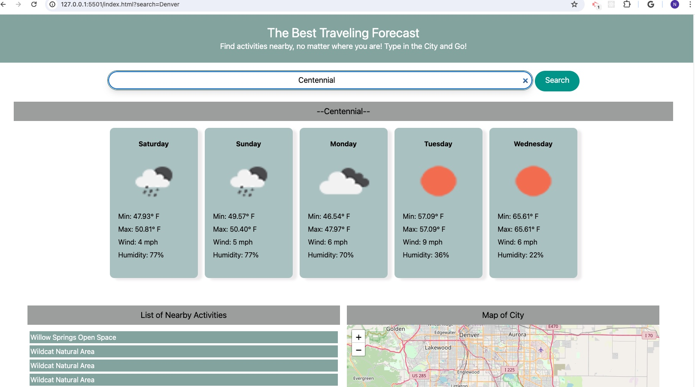

# Project-1, The World Traveler Application

## Description

This is a great application for the word traveler. They can get the weather, a map of the city, and a list of things to do. It is very easy to use, all you need to do is type in the name of the city you are going to and hit submit!

## Screenshot

## User Story

as an avid traveler
I want to be able to look up a city and find a map.
I want to be able to see the weather forecast.
I want to see a list of things to go see.

## Acceptance Criteria

GIVEN a weather forecast, and list of activities
WHEN I see the search bar I can input a city name
WHEN I input the city name
THEN I can see the weather forecast of the related city for five days, I can see the week-day, temprature, wind, humidity and weather icon of the day.
THEN I can see the list of activities to do within the city as a traveler
THEN I can see the city map

## APIs used

- OpenWeather
- Leaflet(map)
- OpenTripMap(activities)

## Languages Used

- Javascript
- CSS with Tailwind
- HTML

## Deployed Link
https://najiba-haidari.github.io/Travel-Forecast/

## Credits @2023

- Najiba Haidari
- Paul Duncan
- Tanvir Iqbal
- Chad Gandelman

## License

Distributed under the MIT License. See LICENSE for more information.
